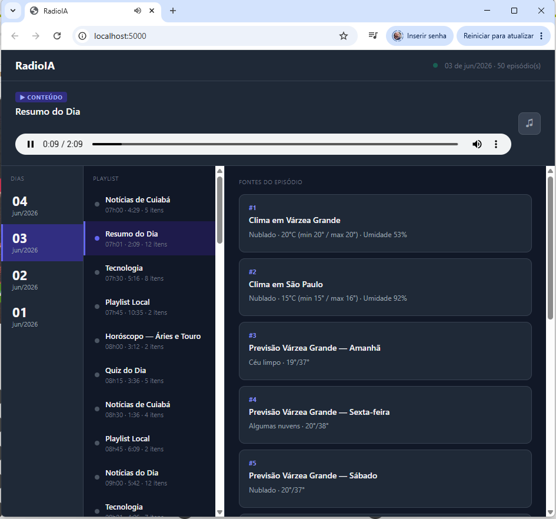
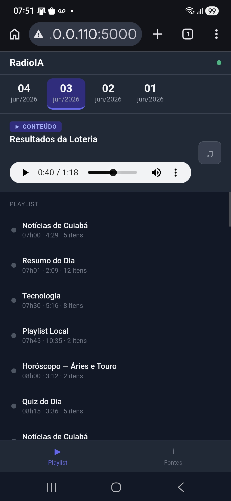
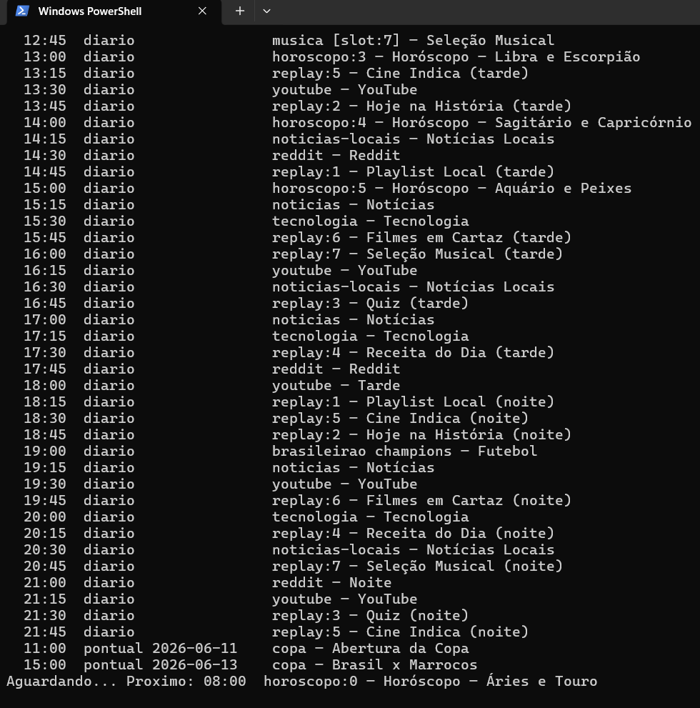

# RadioIA 📻

Rádio personalizada gerada por inteligência artificial. O sistema coleta conteúdo de diversas fontes (YouTube, RSS, Reddit, APIs públicas), gera roteiros com Claude e produz episódios em MP3 narrados por vozes sintéticas — tudo automaticamente.

```
Fontes → Conteúdo → Claude (roteiro) → TTS (áudio) → Episódio MP3
```

---

## Pré-requisitos

- Python 3.11+
- ffmpeg instalado e no PATH ([download](https://ffmpeg.org/download.html))
- Conta na [Anthropic](https://console.anthropic.com) (Claude)
- Conta no [Google Cloud](https://console.developers.google.com) (YouTube Data API v3)

---

## Instalação

```bash
git clone https://github.com/fabianoallex/radioIA.git
cd radioIA
pip install -r requirements.txt
cp config.yaml.example config.yaml
cp .env.example .env
```

> Ambos os arquivos são ignorados pelo git — cada máquina mantém sua própria configuração sem risco de conflito ao fazer `git pull`.

---

## Configuração

### 1. Variáveis de ambiente (`.env`)

```env
# Obrigatórias
ANTHROPIC_API_KEY=sk-ant-...
YOUTUBE_API_KEY=AIza...

# Opcionais (conforme os módulos habilitados)
OPENWEATHER_API_KEY=...        # Clima e previsão do tempo
JAMENDO_CLIENT_ID=...          # Músicas do Jamendo
FOOTBALL_DATA_API_KEY=...      # Futebol (football-data.org)
TMDB_API_KEY=...               # Filmes (themoviedb.org)
```

| Chave | Onde obter | Custo |
|-------|-----------|-------|
| `ANTHROPIC_API_KEY` | [console.anthropic.com](https://console.anthropic.com) | Pago por uso |
| `YOUTUBE_API_KEY` | Google Cloud Console → YouTube Data API v3 | Gratuito (cota diária) |
| `OPENWEATHER_API_KEY` | [openweathermap.org/api](https://openweathermap.org/api) | Gratuito (1000 req/dia) |
| `JAMENDO_CLIENT_ID` | [developer.jamendo.com](https://developer.jamendo.com) | Gratuito |
| `FOOTBALL_DATA_API_KEY` | [football-data.org](https://www.football-data.org) | Gratuito (10 req/min) |
| `TMDB_API_KEY` | [themoviedb.org/settings/api](https://www.themoviedb.org/settings/api) | Gratuito |

### 2. Arquivo de configuração (`config.yaml`)

O `config.yaml` concentra toda a configuração da rádio. Seções principais:

| Seção | O que configura |
|-------|----------------|
| `radio` | Nome da rádio e mixagem de áudio |
| `sources` | Fontes de conteúdo (YouTube, RSS, Utilidades, etc.) |
| `narrators` | Narradores e suas personalidades |
| `vinheta` | Voz e velocidade da vinheta |
| `llm` | Modelo de linguagem e provedor |
| `schedule` | Programação automática |
| `spots` | Pool de spots (propagandas/comunicados) |
| `spots_config` | Frequência de injeção dos spots |
| `downloads` | Opções de download no player |
| `announcements` | Avisos de grade no modo musical |
| `welcome_intro` | Intro de boas-vindas do dia |

**Nome da rádio:** altere apenas `radio.name` — o nome se propaga para roteiros, vinhetas, tags MP3 e interface web automaticamente.

---

## Executando

### Gerar episódios

```bash
python main.py noticias                     # uma fonte
python main.py youtube noticias-locais      # múltiplas fontes
python main.py "url:https://exemplo.com"    # a partir de uma URL
python main.py "clipping:reforma tributaria" # clipping sobre um tema
```

> É obrigatório especificar a fonte. `python main.py` sem argumentos lista as disponíveis.

### Player web

```bash
python serve.py
```

Abre em `http://localhost:5000`. Reproduz episódios automaticamente, entra em modo musical quando não há conteúdo novo, e anuncia os próximos itens da grade entre as músicas.

Para acessar pelo celular na mesma rede Wi-Fi: `http://<IP-local>:5000`

### Admin UI (interface web de administração)

```bash
cd ui && npm install && npm run build && cd ..
uvicorn api.main:app --port 5001
```

Acesse `http://localhost:5001`. Permite gerenciar fontes, grade, spots e configurações sem editar o `config.yaml`. Detalhes em [docs/admin-ui.md](docs/admin-ui.md).

### Scheduler (programação automática)

```bash
python scheduler.py           # inicia o agendador
python scheduler.py --list    # exibe a grade sem rodar
pythonw scheduler.py          # inicia sem janela de terminal (Windows)
```

Detalhes em [docs/scheduler.md](docs/scheduler.md).

---

## Demonstração

| Desktop | Mobile |
|---------|--------|
|  |  |



[▶ Ouvir exemplo (MP3)](docs/episode.mp3)

---

## Estrutura de saída

```
output/
  2026-06-11/
    09-00_noticias/
      episode.mp3       ← áudio do episódio
      episode.json      ← metadados (fontes, links, duração)
    12-00_copa/
      episode.mp3
      episode.json
```

---

## Estrutura do projeto

```
radioIA/
├── main.py                      # ponto de entrada — geração de episódios
├── serve.py                     # player web (Flask, porta 5000)
├── scheduler.py                 # agendador de episódios
├── mcp_server.py                # servidor MCP
├── config.yaml.example          # template de configuração
├── .env.example                 # template de variáveis de ambiente
├── api/                         # Admin UI — FastAPI + React
│   ├── main.py                  # app FastAPI (serve ui/dist/ em produção)
│   ├── routers/                 # endpoints REST por domínio
│   └── services/                # lógica de negócio
├── ui/                          # frontend React + Vite + Tailwind
│   ├── src/pages/               # Dashboard, Gerador, Fontes, Grade, Episódios, Spots, Configurações
│   └── dist/                    # build de produção (gerado por npm run build)
├── mcp_tools/                   # módulos MCP (42 ferramentas)
├── src/                         # pipeline de geração (TTS, LLM, mixagem, histórico)
├── plugins/                     # fontes de conteúdo (carregadas automaticamente)
├── tests/                       # testes unitários
├── music/                       # músicas locais para o fallback do player
└── output/                      # episódios gerados (não versionar)
```

---

## Documentação completa

| Documento | Conteúdo |
|-----------|----------|
| [docs/fontes.md](docs/fontes.md) | Todas as fontes: YouTube, RSS, Utilidades, Reddit, Clipping, Filmes, etc. |
| [docs/tts.md](docs/tts.md) | Motor de voz, narradores, vinheta, provedores TTS, voice_map |
| [docs/llm.md](docs/llm.md) | Modelos LLM, provedores, override por fonte, contexto adicional |
| [docs/scheduler.md](docs/scheduler.md) | Programação automática, `slot_id`/`replay_of`, filtro por dias |
| [docs/mcp.md](docs/mcp.md) | Servidor MCP — 42 ferramentas e configuração |
| [docs/admin-ui.md](docs/admin-ui.md) | Interface web de administração, build, portas dev/prod |
| [docs/spots.md](docs/spots.md) | Spots/propagandas, tipos, rotação, cache de áudio |
| [docs/corporativo.md](docs/corporativo.md) | Adaptação para rádio corporativa interna |
| [docs/criando-geradores.md](docs/criando-geradores.md) | Guia completo para criar novos plugins de conteúdo |
| [docs/streaming.md](docs/streaming.md) | Transmissão ao vivo via Icecast2 + Liquidsoap |

---

## Testes

```bash
pip install -r requirements-dev.txt
python -m pytest tests/ -v
```

| Arquivo | O que cobre |
|---------|-------------|
| `test_tts_generator.py` | Parser de roteiro (`parse_script`) |
| `test_text_utils.py` | Normalização de texto para TTS |
| `test_history.py` | Deduplicação de conteúdo |
| `test_scheduler.py` | Lógica do scheduler — dias da semana, replay |
| `test_plugin_contract.py` | Contrato de plugins — estrutura do retorno de `fetch()` |
| `test_script_context.py` | Injeção de contexto nos prompts |
| `test_script_new_types.py` | Prompts dos tipos `utility` e `combined` |
| `test_utility_format.py` | Formatação de dados para prompt de utilidades |
| `test_parse_value.py` | `_parse_value()` em `mcp_tools._utils` |
| `test_mcp_parse_fonte.py` | `_parse_fonte()` em `mcp_tools._utils` |
| `test_adicionar_fonte.py` | `adicionar_fonte()` em `mcp_tools.config` |
| `test_url_plugin.py` | Plugin `url` — extração e estrutura do item |

---

## Observações

- O histórico de itens veiculados é salvo em `history.json` — evita repetição de conteúdo entre execuções.
- A pasta `music/` aceita `.mp3`, `.m4a`, `.ogg`, `.wav` e `.flac` para o modo fallback do player.
- A ordem dos feeds RSS é embaralhada a cada execução para garantir diversidade entre as fontes.
- O ffmpeg é necessário para a mixagem de áudio — certifique-se de que está no PATH do sistema.
